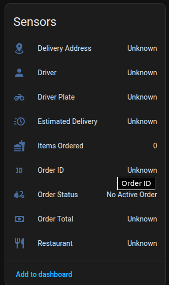
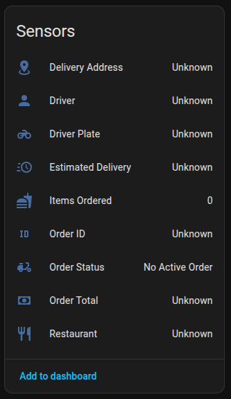

<p align="center">
  <a name="logo" href="http://nightdestiny.com">
    
  </a>
</p>
# Grab Food Thailand

[](https://github.com/hacs/integration)
[](https://github.com/simplemice/ha_grab_food_thailand/releases)
[](LICENSE)

> **Unofficial** Home Assistant integration — not affiliated with or endorsed by Grab Holdings.

Track your active Grab Food Thailand orders inside Home Assistant. Know when your food is picked up, where your driver is, and when it arrives — without opening the app.

---

## What you get

9 sensors updated every 30 seconds while an order is active, falling back to 5-minute polling when idle:

| Sensor | What it shows |
|--------|--------------|
| **Order Status** | Current lifecycle state (placed → confirmed → preparing → delivering → delivered) |
| **Restaurant** | Name of the restaurant |
| **Order Total** | Price in THB |
| **Estimated Delivery** | ETA as a time string or ISO timestamp |
| **Driver** | Driver name + GPS coordinates as attributes |
| **Driver Plate** | Vehicle licence plate |
| **Items Ordered** | Number of items + item name list as attribute |
| **Order ID** | Grab order reference |
| **Delivery Address** | Drop-off address |

---

## Requirements

- Home Assistant **2024.1** or newer
- A **Grab account** with food orders in Thailand
- Your Grab **access token** (see [Getting your token](#getting-your-token) below)

---

## Installation

### Via HACS (recommended)

1. Open **HACS → Integrations → ⋮ → Custom repositories**
2. Add `https://github.com/simplemice/ha_grab_food_thailand` — category **Integration**
3. Search for **Grab Food Thailand** and click **Download**
4. Restart Home Assistant

### Manual

1. Download the [latest release](https://github.com/simplemice/ha_grab_food_thailand/releases/latest)
2. Copy the `custom_components/grab_food/` folder into your HA `config/custom_components/` directory
3. Restart Home Assistant

---

## Getting your token

The integration authenticates using a bearer token from your Grab mobile app session, intercepted with **HTTPCanary** on Android. This method gives you a long-lived token that includes a refresh token — meaning the integration can silently renew itself without asking you to re-authenticate.

### What you need

- An Android phone with the **Grab** app installed and logged in
- **HTTPCanary** — [download from Google Play](https://play.google.com/store/apps/details?id=com.guoshi.httpcanary)

### Step-by-step

**1. Install HTTPCanary and set up the CA certificate**

1. Install HTTPCanary from the Play Store and open it
2. Tap the yellow **+** button at the bottom right → **Install Root Certificate**
3. Follow the on-screen prompts to install the certificate into your Android system trust store
   - On Android 7+: go to **Settings → Security → Install from storage** and select the HTTPCanary certificate
   - On Android 11+: you may need to enable the certificate in **Settings → Security → Trusted credentials → User**

> If your device runs Android 7 or newer, Grab's app uses certificate pinning and you may need a **rooted device** or an older Android version (Android 6 or below) to intercept HTTPS traffic. Alternatively, use an Android emulator such as **Genymotion** or **Android Studio AVD** with root enabled.

**2. Start capturing traffic**

1. In HTTPCanary tap the **▶ (play)** button — the capture icon turns red
2. A VPN permission prompt appears — tap **OK** to allow HTTPCanary to intercept traffic
3. Minimise HTTPCanary (do not close it)

**3. Open Grab and trigger an API call**

1. Open the **Grab** app
2. Go to **GrabFood** — browse restaurants or check an existing order
3. Any screen that loads data will trigger background API calls to Grab's servers

**4. Find the token in HTTPCanary**

1. Switch back to HTTPCanary — you will see a list of captured requests
2. Tap the **search / filter** icon and type `grab` to narrow the list
3. Look for any request to a domain like `food.grab.com` or `api.grab.com`
4. Tap that request to open it, then go to the **Request** tab → **Headers**
5. Find the header named **`Authorization`**
6. Its value looks like:
   ```
   Bearer eyJhbGciOiJSUzI1NiIsInR5cCI6IkpXVCJ9...
   ```
7. Long-press the value and copy **everything after `Bearer `** (do not include the word `Bearer` or the space)

**5. Find the refresh token (optional but recommended)**

1. In the same request headers, look for a header named **`X-Grab-Refresh-Token`** or check the response body of any `/token` or `/auth` call
2. Alternatively, open the Grab app's **Network** logs and look for the login/token response — it typically contains both `access_token` and `refresh_token` fields as JSON
3. Copy the `refresh_token` value if present

**6. Add the tokens to Home Assistant**

1. Go to **Settings → Devices & Services → Add Integration**
2. Search for **Grab Food Thailand**
3. Paste your `access_token` (starting with `eyJ`) into the **Access token** field
4. Paste your `refresh_token` into the **Refresh token** field (leave blank if you did not find one)
5. Click **Submit**

> The access token is a JWT string starting with `eyJ`. It is typically several hundred characters long. Copy the complete value with no extra spaces or line breaks.

---

## Setup

1. Go to **Settings → Devices & Services → Add Integration**
2. Search for **Grab Food Thailand**
3. Paste your `access_token` into the **Access token** field
4. Optionally paste your `refresh_token` if you have one (from HTTPCanary)
5. Click **Submit**

All 9 sensors appear under a single **Grab Food** device immediately after setup.

### Re-authentication

When a token expires and no refresh token is available, Home Assistant shows a notification prompting you to re-authenticate. Open the integration, paste a fresh token, and all sensors resume normally.

---

## Screenshots

 

---

## Automation examples

### Announce when food is picked up

```yaml
alias: "Grab Food — picked up announcement"
trigger:
  - platform: state
    entity_id: sensor.grab_food_order_status
    to: picked_up
action:
  - service: tts.speak
    target:
      entity_id: media_player.living_room
    data:
      message: >
        Your order from {{ states('sensor.grab_food_restaurant_name') }}
        has been picked up. ETA {{ states('sensor.grab_food_estimated_delivery') }}.
```

### Push notification on delivery

```yaml
alias: "Grab Food — delivered notification"
trigger:
  - platform: state
    entity_id: sensor.grab_food_order_status
    to: delivered
action:
  - service: notify.mobile_app_your_phone
    data:
      title: "🍔 Food delivered!"
      message: >
        {{ states('sensor.grab_food_restaurant_name') }} ·
        {{ states('sensor.grab_food_order_total') }} THB ·
        {{ states('sensor.grab_food_item_count') }} items
```

### Turn on porch light when driver is close

Combine the driver GPS attributes with a `proximity` helper or a `template` sensor to detect when the driver is within a certain distance:

```yaml
alias: "Grab Food — light on when driver nearby"
trigger:
  - platform: numeric_state
    entity_id: sensor.grab_food_driver_name   # lat/lon in attributes
    attribute: latitude
    # Use a proximity helper for real distance check
condition:
  - condition: state
    entity_id: sensor.grab_food_order_status
    state: delivering
action:
  - service: light.turn_on
    target:
      entity_id: light.porch
```

### Dashboard card — live order summary

```yaml
type: entities
title: Grab Food Order
entities:
  - entity: sensor.grab_food_order_status
  - entity: sensor.grab_food_restaurant_name
  - entity: sensor.grab_food_estimated_delivery
  - entity: sensor.grab_food_driver_name
  - entity: sensor.grab_food_order_total
  - entity: sensor.grab_food_item_count
```

### Dashboard card — driver on a map

```yaml
type: map
entities:
  - entity: sensor.grab_food_driver_name
    label_mode: state
```

> The driver's current GPS position is stored in the `latitude` and `longitude` attributes of `sensor.grab_food_driver_name`. The map card picks these up automatically when `label_mode` is set.

---

## Order status states

| State | Meaning |
|-------|---------|
| `no_active_order` | No order in progress |
| `placed` | Order submitted to restaurant |
| `confirmed` | Restaurant accepted the order |
| `preparing` | Food is being prepared |
| `driver_assigned` | A driver has been matched |
| `picked_up` | Driver collected the food |
| `delivering` | Driver is on the way |
| `delivered` | Order delivered successfully |
| `cancelled` | Order was cancelled |

---

## How it works

```
config_flow  →  paste access token (+ optional refresh token)
__init__     →  creates API client and coordinator, forwards to sensor platform
coordinator  →  polls Grab API on adaptive schedule; persists refreshed tokens
sensor       →  9 CoordinatorEntity sensors; each reads one field from coordinator data
api          →  async aiohttp client handling auth, token refresh, order fetch
```

Polling interval adapts automatically:
- **30 seconds** — while an order status is active
- **5 minutes** — when no order is in progress

If the access token expires the coordinator calls the Grab refresh endpoint transparently. If that also fails, HA triggers the reauth flow and pauses data updates until you provide a fresh token.

---

## Limitations & notes

- **Unofficial API** — this integration relies on Grab's internal mobile API. Endpoints, field names, and authentication flows can change without notice.
- **Thailand only** — tested against the Thai Grab region. Other countries may use different API endpoints.
- **One active order** — Grab allows only one active food order per account; the integration always tracks the first one returned.
- **Token lifespan** — browser tokens typically expire in hours. HTTPCanary-sourced tokens with a refresh token can last much longer.
- **Rate limits** — Grab may throttle aggressive polling. The defaults (30 s / 5 min) are deliberately conservative.

---

## Contributing

Bug reports and pull requests are welcome.

1. **Fork** the repository and create a branch from `main`
2. Make your changes — keep them focused; one fix or feature per PR
3. Test manually with a real Grab account or adapt the existing test scaffold in the repo
4. Open a pull request with a clear description of what changed and why

If you discover updated Grab API endpoints (e.g. via HTTPCanary), please open an issue or PR updating `custom_components/grab_food/const.py` — that is the single source of truth for all API URLs.

---

## License

[MIT](LICENSE) — use freely, no warranty.
